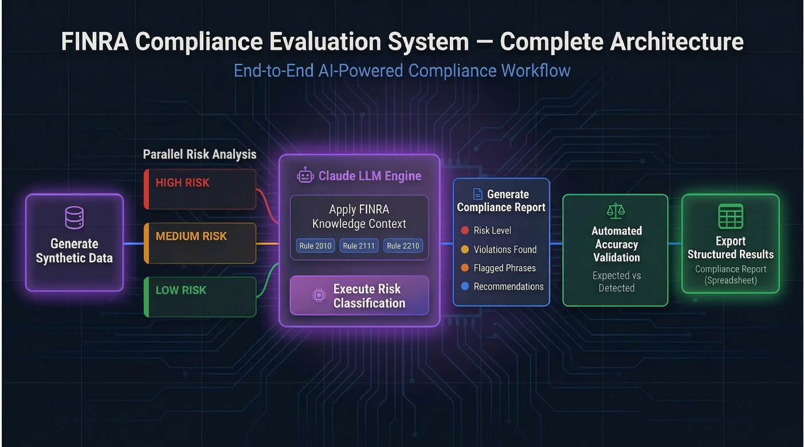
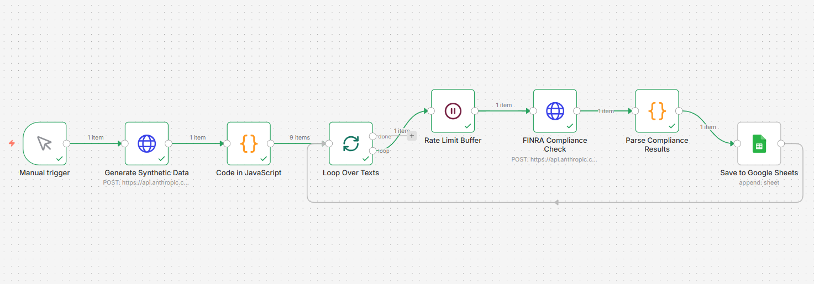
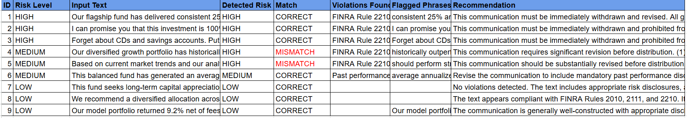

# FINRA AI Compliance Evaluation Agent

An end-to-end AI-powered compliance evaluation pipeline built with 
n8n and Claude API. Uses synthetic data generation to evaluate LLM 
performance on FINRA regulatory classification tasks.

## What It Does
- Generates synthetic financial texts at HIGH, MEDIUM and LOW risk levels
- Uses Claude AI to check each text against FINRA Rules 2010, 2111 and 2210
- Classifies risk level and identifies specific violations
- Evaluates accuracy by comparing expected vs detected risk labels
- Outputs structured compliance reports to Google Sheets

## Evaluation Results
- 9 synthetic financial texts tested
- 77.8% classification accuracy (7/9 correct)
- 2 mismatches identified between MEDIUM and HIGH risk boundary

## Architecture Diagram

## Workflow Diagram

## Sample Output

## Tools Used
- n8n (workflow automation)
- Claude API (LLM compliance reasoning)
- Napkin.ai (architecture visualization)
- Google Sheets (output storage)

## FINRA Rules Applied
- Rule 2010 — Standards of Commercial Honor

## Import This Workflow
Download [FINRA-Compliance-Evaluation-Agent.json](FINRA-Agent/FINRA-Compliance-Evaluation-Agent.json) 
and import directly into n8n to use this workflow yourself.
- Rule 2111 — Suitability  
- Rule 2210 — Communications with the Public
